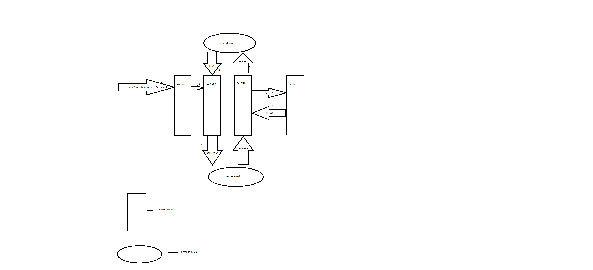

# worker

This microservice makes it possible for you to execute scenarios using the Selenium WebDriver.
The program receives a scenario from a scenario queue, then requests a proxy from 
[the proxy microservice](https://github.com/victortarasov1/proxy_microservice) 
and executes the scenario using Selenium WebDriver. When the scenario 
is completed, it sends a report with information about the execution of each step, 
errors, etc., to a reports queue.
[You can see a microservice that provides proxies here.](https://github.com/MorgothGorthaur/publisher_microservice/)
Each scenario must contain a name, a site's URL, and a list of steps. 
Currently, there are three types of steps: 'sleep', 'clickCss', and 'clickXpath'. 
The program also provides the ability for multithreaded execution of scenarios 
(you need to set the number of threads in the property file).
The program supports concurrent execution of scenarios with the ability to [configure](https://github.com/victortarasov1/executor-service-configuration) 
the number of threads in the property file.

you can run microservices using docker compose and see additional documentation  [here](https://github.com/victortarasov1/executor-service-docker-compose)

## Flow


## Json Examples

### Proxy Example
```json
{
  "id": "74ce8215-e6b0-4e43-9f5c-481fb3f40d42",
  "proxyNetworkConfig": {
    "id": "f89664ee-6286-4275-807d-d5ab0f85841d",
    "hostname": "45.65.137.218",
    "port": 999
  },
  "proxyCredentials": {
    "username": "",
    "password": ""
  },
  "createdAt": "2024-07-03T15:08:35.890147Z"
}
```
### Scenario Example

```json
 {
  "id": "6c933798-722b-4539-8544-5f9bb2fefc9f",
  "name": "linux scenario",
  "site": "https://kernel.org/",
  "steps": [
    {
      "id": "9d24893f-37d4-4f53-b7fa-0852516d39da",
      "action": "sleep",
      "value": "5000:8000",
      "createdAt": "2024-07-03T15:02:59.752771Z"
    },
    {
      "id": "cb437fb8-2069-46bc-9f87-1f1e72545f03",
      "action": "clickCss",
      "value": "#banner > nav > ulwww > li:nth-child(1) > a",
      "createdAt": "2024-07-03T15:02:59.754714Z"
    },
    {
      "id": "2a431e78-e8a6-4721-a006-d871b0226d0d",
      "action": "sleep",
      "value": "3000:5000",
      "createdAt": "2024-07-03T15:02:59.756483Z"
    },
    {
      "id": "ecfaa716-9204-4c44-8968-a922e7598544",
      "action": "clickXpath",
      "value": "/html/body/footer/address[2]/a[4]",
      "createdAt": "2024-07-03T15:02:59.758472Z"
    },
    {
      "id": "1630dce4-c8e2-4d9b-90d9-766b47e5599c",
      "action": "sleep",
      "value": "3000:5000",
      "createdAt": "2024-07-03T15:02:59.760070Z"
    }
  ],
  "createdAt": "2024-07-03T15:02:59.690204Z"
}
```

### Report Example 
```json
 {
        "id": "0c7bf91b-9185-4ba8-9677-5d7718de003a",
        "scenarioId": "6c933798-722b-4539-8544-5f9bb2fefc9f",
        "startTime": "2024-07-03T15:03:51.33485",
        "endTime": "2024-07-03T15:03:53.226406",
        "errorMessage": "Failed to perform 'Sleep' step.",
        "webDriverInfo": "RemoteWebDriver: chrome on linux (ae6058186077e5f81c3495d248d0e5de)",
        "name": "linux scenario",
        "site": "https://kernel.org/",
        "stepReports": [
            {
                "id": "e46c11b3-f81a-4f8f-b5a6-46e162002b1a",
                "startTime": "15:03:53.223",
                "endTime": "15:03:53.226",
                "errorMessage": "Failed to perform 'Sleep' step.",
                "action": "sleep",
                "value": "8000:5000"
            }
        ]
    }
```

## Used Technologies

### Back-end:
- Spring Actuator
- Spring Cloud Config
- Spring Cloud Eureka
- Spring Cloud OpenFeign
- Spring Cloud Circuit breaker
- Spring Cloud Stream 
- prometheus
- Selenium
- Logback
- Spring Boot
- AspectJ
- Mockito
- AssertJ

### Server build:
- gradle
- google jib

## Requirements
- java 17
- gradle
- docker (optionally)


